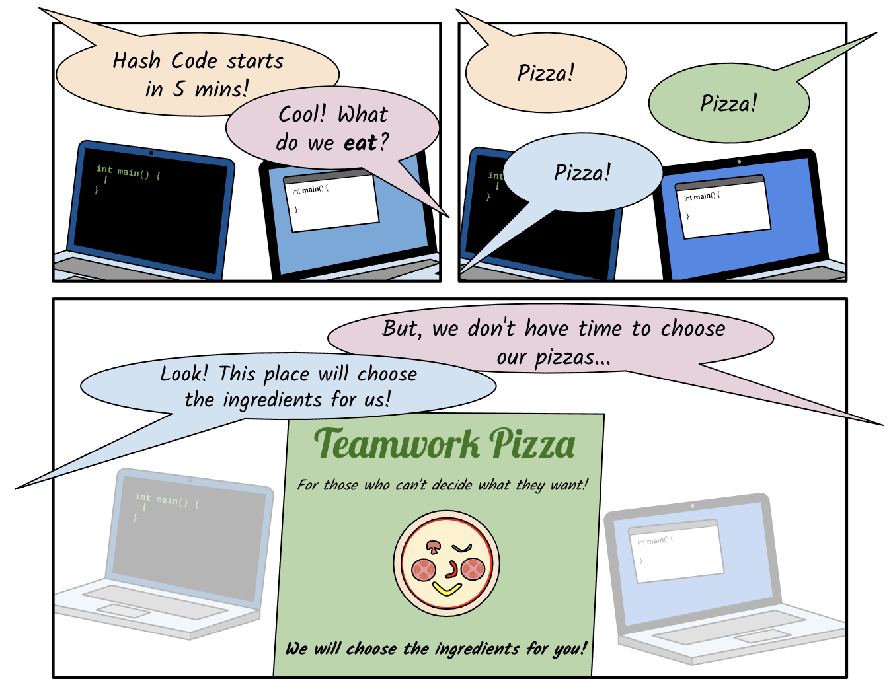
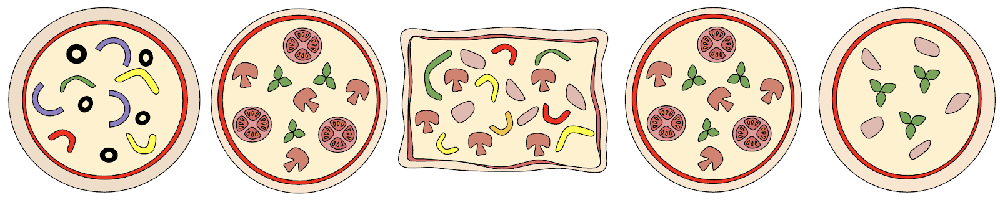

<p align="center">
  
</p>

# Hash Code 2021 - Even More Pizza (Practice Problem)

This is my attempt at solving the practice problem that is provided from
Google in preparation for the competition. The problem statement is
included in the files.

## Requirements

- `Python 3.9+` due to the usage of typing (You can remove them, or
  replace the `list` and `set` typings with their `List` and `Set`
  equivalents if you wish to run the script on an older version).
- You need to install `tqdm` by running `pip install tqdm`.

## Code usage

Run main.py by typing the following command:

```sh
python main.py
```

Running the script will try the solution on all provided input files,
and print the resulting score for each one. This might take a long time
for `d.in` and `e.in` due to how big they are.

## Results

<p align="center">
  
</p>

| Input Data Set                 | Score              |
|:-------------------------------|:-------------------|
| A - Example                    | 74 points          |
| B - A little bit of everything | 11,693 points      |
| C - Many ingredients           | 709,349,652 points |
| D - Many pizzas                | 7,949,578 points   |
| E - Many teams                 | 10,868,771 points  |
| Total score                    | 728,179,768 points |

## Useful Links

- [Competition Link](https://codingcompetitions.withgoogle.com/hashcode/)
- [Judge System](https://hashcodejudge.withgoogle.com/)

